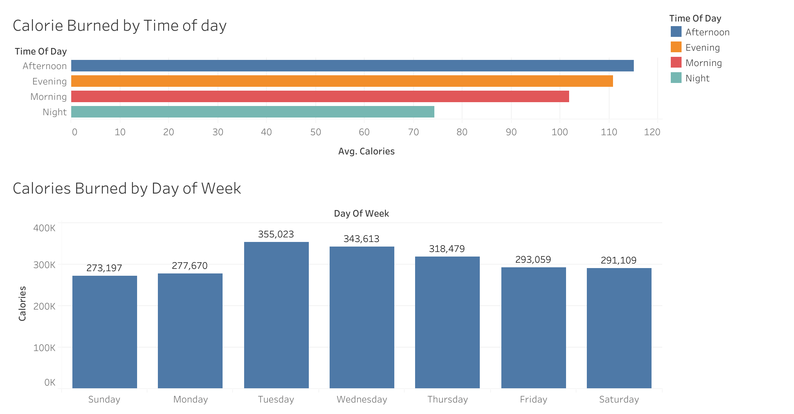
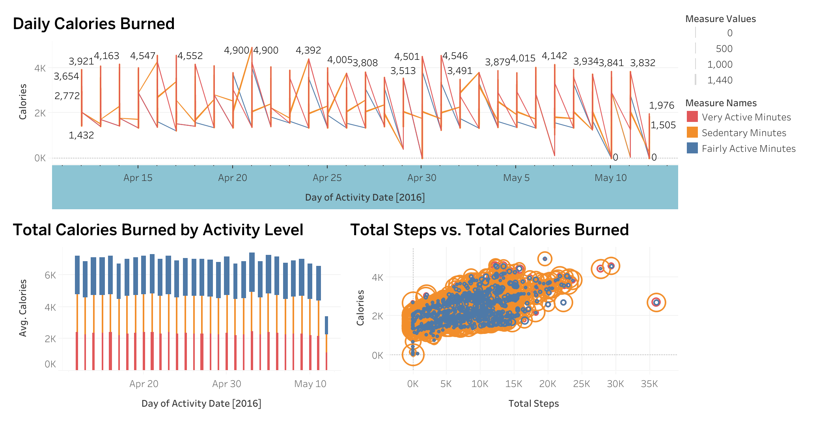

# Bellabeat Data Analysis Case Study

## Introduction

Welcome to the Bellabeat Data Analysis Case Study! As junior data analysts at Bellabeat, we delve into smart device usage data to understand consumer behavior, particularly focusing on non-Bellabeat devices.

## Business Task

Our task, assigned by our fictional character Sršen at Bellabeat, revolves around understanding the trends in smart device usage. The overarching goal is to leverage these insights to benefit Bellabeat and its customers.

## Key tools used to perform this analysis: MYSQL,Excel,Tableau

# Calorie Burn Analysis

# Calorie Burn Analysis

## 1. Calorie Burned by Part of Week & Time of Day

- Afternoon (12:00 PM - 5:00 PM) shows the highest average calories burned (115).
- Evening follows closely with an average of 110 calories.
- Morning exhibits moderate activity with an average of around 100 calories.
- Night records the lowest activity, with an average of 75 calories.

**Insights:** Majority of people are most active during the afternoon.

## 2. Calories Burned by Day of Week

1. Tuesday records the highest total calories burned (355,023).
2. Wednesday follows closely with 343,613 calories.
3. Thursday maintains a high activity level with 318,479 calories.
4. Friday and Saturday have lower totals (293,059 and 291,109 calories, respectively).
5. Surprisingly, Monday's total calories burned (277,670) are less than Saturday's.

**Insights:** Higher calorie burn on Saturday compared to Monday challenges conventional expectations.

## Conclusion
Understanding when and how calories are burned provides valuable insights for tailoring health and wellness strategies. Further exploration into the factors driving these patterns can inform targeted interventions and marketing strategies.

#Dashboard 2

# Combined Analysis Insights

## Scatter Plot: Steps vs Calories

- **Axes:** X-axis (Total Steps: 0K to 35K), Y-axis (Calories: 0K to 5K)
- **Data Distribution:** Most data clustered between 5K to 20K steps and 1K to 4K calories.
- **Color Coding:** Blue (Fairly Active), Grey (Sedentary), Orange (Very Active).
- **Insight:** Positive correlation between steps and calories; higher steps generally result in more calories burned.
- **Activity Levels:** 'Very Active Minutes' prevalent in higher steps and calories range, suggesting intense activity.

## Line Graph: Daily Activity Levels

- **Axes:** X-axis (Day of Activity Date [2016]: April 15 to May 10), Y-axis (Calories: 0 to 5000).
- **Lines:** Very Active Minutes (red), Sedentary Minutes (orange), Fairly Active Minutes (yellow).
- **Trends:** Peaks and troughs in daily calories burned for each activity level.
- **Insight:** Very active minutes lead to spikes in calorie burn; sedentary days still contribute to significant calorie burn.
- **Consistency:** Even on days with fewer steps, consistent fairly or very active minutes contribute to higher calorie burn.

## Combined Analysis:

- **Correlation Confirmation:** The line graph validates the positive correlation observed in the scatter plot; more steps generally mean more calories burned.
- **Intense Activity Impact:** Days with higher very active minutes show pronounced peaks in calorie burn, emphasizing the impact of intense activity.
- **Sedentary Contribution:** Sedentary days still contribute to calorie burn, possibly due to basal metabolic rate, indicating the importance of consistent activity.
- **Duration Influence:** Varying data point sizes suggest that larger points (longer activity duration) contribute to higher steps and calorie burn.

### Conclusion:

Understanding the relationship between steps, activity levels, and calorie burn is crucial. Tailoring fitness strategies to promote consistent activity, including both intense and light activities, can optimize overall health and well-being.

# Recommendations based on Analysis

## 1. Trends in Smart Device Usage

### Recommendations:
- Conduct a comprehensive analysis of peak usage times for smart devices industry-wide.
- Investigate weekly patterns and identify factors contributing to variations.

## 2. Applying Trends to Bellabeat Customers

### Recommendations:
- Tailor Bellabeat product features to align with the observed peak activity times.
- Investigate the factors contributing to higher calorie burn on Saturdays and leverage insights for product enhancement.

## 3. Influencing Bellabeat Marketing Strategy

### Recommendations:
- Incorporate the positive correlation between steps and calories in marketing messages.
- Emphasize the impact of intense activity on overall well-being in marketing campaigns.
- Consider creating marketing campaigns targeting specific time slots based on peak usage times.

By understanding these trends and strategically applying them to Bellabeat's products and marketing, the company can enhance user experience, optimize fitness strategies, and better connect with its customer base.

